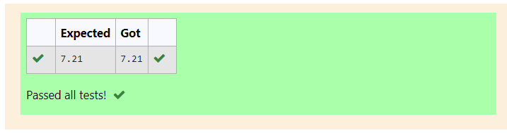

# DISTANCE-BETWEEN-TWO-POINTS

## AIM:
To write a python program to find the distance two 2 points
## ALGORITHM:
### Step 1: import math
### Step 2: d2=[a,b]
### Step 3: d1=[c,d]
Substitute the values in the distance formula  
### Step 4: distance=math.sqrt((d2[0]-d1[0])**2+(d2[1]-d1[1])**2)
### Step 5: print(format(distance,".2f"))
### PROGRAM:
~~~
import math
d2=[10,6]
d1=[4,2]
distance=math.sqrt((d2[0]-d1[0])**2+(d2[1]-d1[1])**2)
print(format(distance,".2f"))
~~~
  

### OUTPUT:

### RESULT:
Therefore the Distance between 2 points is caluculated.
